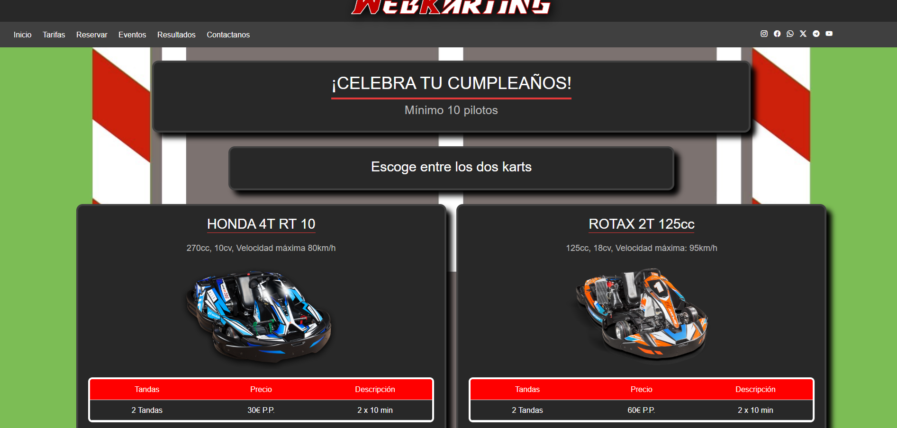
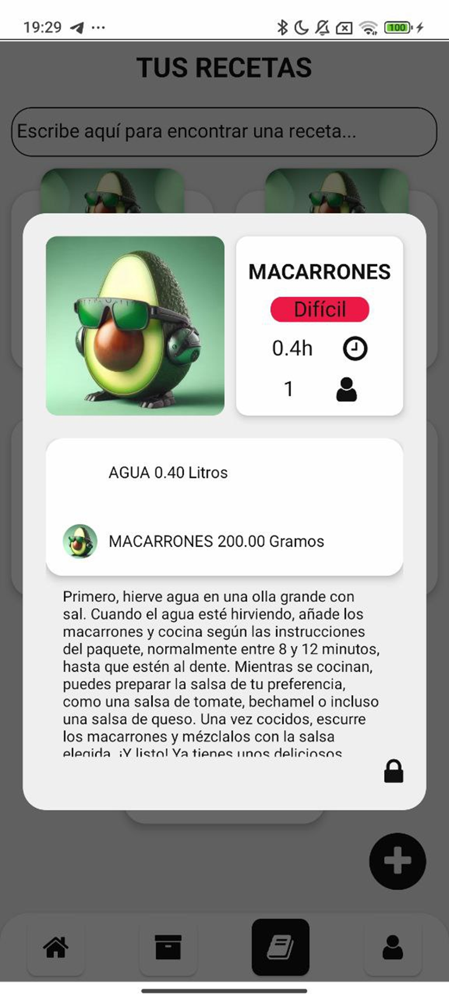
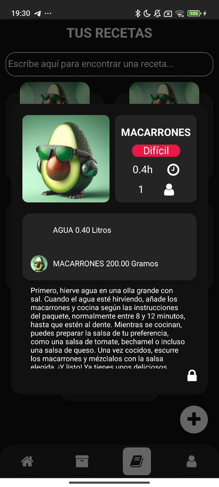

# ¡Hola, soy Aaron! 👋

Graduado en Ingenieria Informatica 🎓| Desarrollador Fullstack (React / Node.js) ⚛️

## Portfolio 

- [**PORFOLIO**](https://portfolio-zeta-puce-79.vercel.app/) - Pagina web desarrollada como ayuda al CV

### 🚀 Proyectos destacados
- [**WEBKARTING**](https://github.com/Aaronmn03/WebKarting) - Pagina web desarrollada como un proyecto para la universidad con Spring Boot.

  
  
- [**Aplicacion de recetas**](https://github.com/Aaronmn03/app-recipies) - Aplicacion para recetas de cocina con React Native (En Desarrollo).

  
  

### 🛠️ Tecnologías que uso

### 📈 Estadísticas de GitHub

### 📫 Contáctame
- InfoJobs -> Aarón Martínez
- [LinkedIn](https://www.linkedin.com/in/aaron-martinez-navio-33829a258/)
